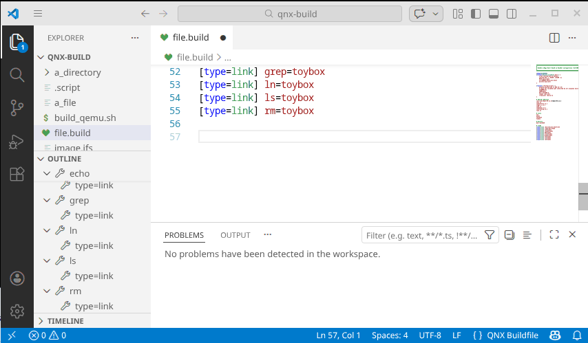

# qnx-buildfile-lang



This is an Xtext-based grammar for parsing QNX buildfiles. 

The rest of this README is for developers who want to contribute to the grammar. If you are a developer interested in using it, please go to https://gvergine.github.io/qnx-buildfile-lang

## Prerequisites

- Recent Linux with jdk 17
- Eclipse IDE for DSL Developers
  Maven (minimum version 3.9)

## Compile from Eclipse

- Clone this repo via Eclipse
- It should compile in Eclipse out of the box

## Compile from command line

```
mvn clean package
```

## Release (only for mantainers)

```
mvn -P release clean deploy -DskipPublishing=true
```

Test and publish manually on Sonatype.
