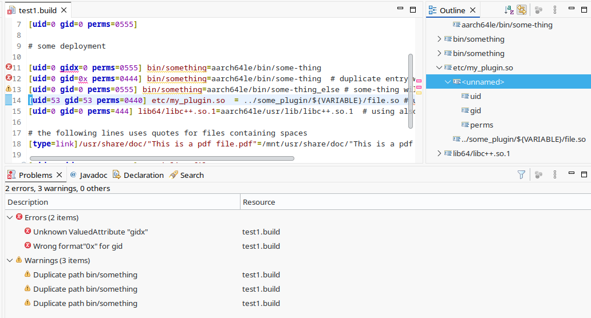
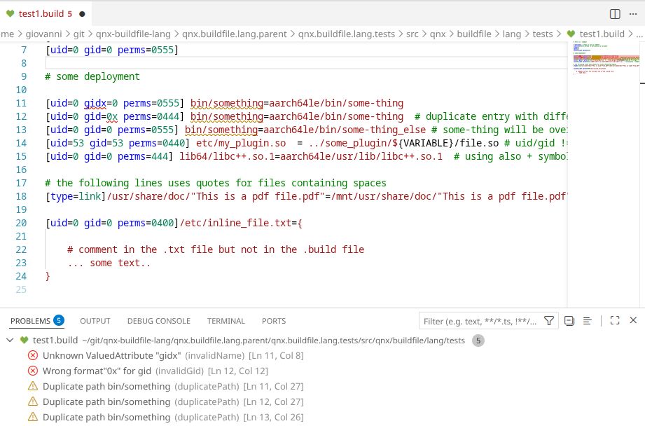
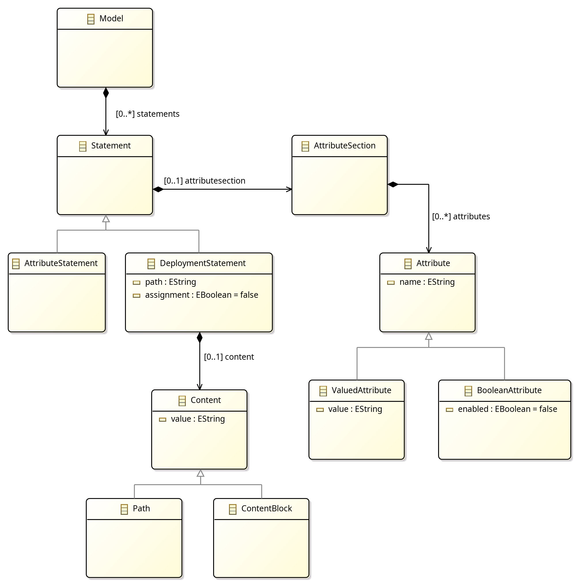

:toc: left
:toclevels: 3
:sectnums:
:icons: font
:source-highlighter: rouge

ifdef::backend-pdf[]
= qnx-buildfile-lang documentation {release_version}
endif::[]
ifndef::backend-pdf[]
= qnx-buildfile-lang {release_version}
endif::[]

[.small]
Giovanni Vergine, verginegiovanni@gmail.com
[.small]
Date: {doc_date}

toc::[]

ifdef::backend-pdf[]
endif::[]
ifndef::backend-pdf[]
[TIP]
.PDF documention
====
Download the pdf version of this documentation here: link:qnx-buildfile-lang-documentation.pdf[qnx-buildfile-lang-documentation.pdf].
====
endif::[]

<<<

== qnx-buildfile-lang

QNX buildfiles play a central role in many embedded and automotive systems. As systems scale, buildfiles naturally increase in complexity, which makes early validation, consistency, and policy enforcement increasingly important.

`qnx-buildfile-lang` project provides:

* A complete Xtext grammar for QNX buildfiles, ensuring instant syntax validation, syntax highlighting and code completion inside Eclipse
* A reference executable jar for generic validation of buildfiles. Maven library that enables programmatic parsing, additinal opportunities for semantic validation, automation, and CI checks.
* A standalone Maven library that can be used to write your own java-based tooling, enabling programmatic parsing, additional semantic validation, automation, and CI checks.

This project was built to make QNX development smoother, more reliable, and more automatable for teams working on embedded or automotive platforms.

=== Key Features

`qnx-buildfile-lang` is a set of java-based tooling implemented using link:https://eclipse.dev/Xtext/[Xtext] for parsing link:https://www.qnx.com/developers/docs/8.0/com.qnx.doc.neutrino.building/topic/buildfiles/buildfile_syntax.html[QNX Buildfiles] 

* Available as an Eclipse Plugin or Visual Studio Code extension
** Syntax highlighting
** Real-time syntax validation
** Better readability and safer editing

* Available as command line standalone executable jar
** Enables parsing of buildfiles programmatically
** Useful for addding validation to CI/CD pipelines

* Available as a standalone Java library
** Integrate into custom tooling
** Distributed via Maven Central

=== Project Status & Compatibility

* Minimum JRE required: 17

=== Resources

* Source code: link:https://github.com/gvergine/qnx-buildfile-lang[qnx-buildfile-lang]
* Issue tracker: link:https://github.com/gvergine/qnx-buildfile-lang/issues[qnx-buildfile-lang/issues]
* License: link:https://github.com/gvergine/qnx-buildfile-lang/blob/master/LICENSE[Apache License Version 2.0, January 2004]

<<<

== The Eclipse plugin

Like most of the Xtext-based projects, an Eclipse Feature is available and is deployed to Maven. Follow the steps below to understand how to get it, install it and use it.

=== Installation

Download the Eclipse Repository as a ZIP from Maven Central.
Look for `qnx.buildfile.lang.repository-{Version}.zip` in link:https://central.sonatype.com/artifact/io.github.gvergine/qnx.buildfile.lang.repository[Maven Central]

E.g. latest version `{release_version}` can be found at link:https://repo1.maven.org/maven2/io/github/gvergine/qnx.buildfile.lang.repository/{release_version}/[]

Once downloded, follow the usual steps to install it in Eclipse:

* Help → Install New Software → Add → Archive…
* Select the ZIP file and proceed with installation
* Restart Eclipse

[NOTE]
====
Even if Momentics is Eclipse-based, support for Momentics IDE is still work in progress.
====

=== Usage

[CAUTION]
.Xtext Nature
====
When opening a QNX .build file for the first time in an Eclipse project, Eclipse will ask if to allow the Xtext Nature for such project. This is mandatory to enable the editor.
====

Syntax checking and highlighting should be available as in the following picture:



<<<

== The Visual Studio Code extension

Xtext supports the Language Server protocol out of the box, that works very well with Visual Studio Code.

=== Installation

Download the extension as a `.vsix` from Maven Central.
Look for `qnx.buildfile.lang.lsp-{version}.vsix in link:https://central.sonatype.com/artifact/io.github.gvergine/qnx.buildfile.lang.lsp[Maven Central]

E.g. latest version `{release_version}` can be found at link:https://repo1.maven.org/maven2/io/github/gvergine/qnx.buildfile.lang.lsp/{release_version}/[]

Once downloded, follow these steps for installing in vscode:

```shell
(optional) $ code --uninstall-extension gvergine.qnx-buildfile-lang
$ code --install-extension path/to/qnx.buildfile.lang.lsp-{version}.vsix
```

Then, restart vscode.


=== Usage


Syntax checking and highlighting should be available as in the following picture:



<<<

== The command line standalone executable jar

A ready-to-use executable jar for command line validation is available as well. This is mostly useful for integration in a script or in a CI/CD pipeline.

It supports the same validation rules of the Eclipse Plugin, but they are printed on the standard error, and the exit code will be 0 only if no errors are found.


=== Installation
Download the command line standalone executable jar from Maven Central.
Look for `qnx.buildfile.lang.cli-{Version}-shaded.jar` in link:https://central.sonatype.com/artifact/io.github.gvergine/qnx.buildfile.lang.cli[Maven Central]

E.g. latest version `{release_version}` can be found at link:https://repo1.maven.org/maven2/io/github/gvergine/qnx.buildfile.lang.cli/{release_version}/[]


=== Usage

[IMPORTANT]
.Java Version
====
Make sure you use a JRE version 17+
====

You can specify multiple files on the same command line, e.g:

[source,shell,subs="attributes,verbatim"]
----
java -jar qnx.buildfile.lang.cli-{release_version}-shaded.jar -i=<inputs>[,<inputs>...] [-i=<inputs>[,<inputs>...]]...
  -i=<inputs>[,<inputs>...]
         buildfile(s)
----

This example shows a succesful run:

[source,shell,subs="attributes,verbatim"]
----
$ java -jar qnx.buildfile.lang.cli-{release_version}-shaded.jar -i path/to/first.build -i path/to/second.build
QNX Buildfile Validator version {release_version}
Processing path/to/first.build
Processing path/to/second.build
Done - 0 failures
$ echo $?
0
----


Errors and warnings will be reported on standard error, and exit code will be 1 if any error occourred:

[source,shell,subs="attributes,verbatim"]
----
$ java -jar qnx.buildfile.lang.cli-{release_version}-shaded.jar -i path/to/error.build
QNX Buildfile Validator version {release_version}
Processing path/to/error.build
ERROR at path/to/error.build:11: Attribute name "gidh" is not known
Done - 1 failure
$ echo $?
1
----

<<<

== Getting Started with the standalone Java library

The standalone Java library allows you to build your own java-based tooling. Typical use cases are:
- extending the validation rules for enforcing additional policies
- integrate with java-based environments (e.g. Tomcat, Java-based GUIs)
- generation (e.g. xml or csv representation of the buildfile for further processing with non-java tools)

=== Installation

You can get the latest version via Maven Central:
[source,xml,subs="attributes,verbatim"]
----
<dependency>
  <groupId>io.github.gvergine</groupId>
  <artifactId>qnx.buildfile.lang</artifactId>
  <version>{release_version}</version>
</dependency>
----

=== Key concepts to remember

When using a parser library, it is important first to understand the Abstract Syntax Tree that the parser will produce in memory.
When the AST is known, will be easy to access any part of the model and to validate it or generate output accordingly.

There are multiple ways to see and remember the AST.

* If you are familiar with the Xtext grammar notation, you can see understand the AST by link:https://github.com/gvergine/qnx-buildfile-lang/blob/master/qnx.buildfile.lang.parent/qnx.buildfile.lang/src/qnx/buildfile/lang/BuildfileDSL.xtext[looking at it]. 
* Javadoc is generated and available via Maven as well
* Referring to the following class diagram:



=== Examples

==== Parsing programmatically:

[source,java]
----
import qnx.buildfile.lang.utils.Parser;
import qnx.buildfile.lang.utils.ParsingResult;

// ...

Parser parser = new Parser();
File file = new File(filename);
ParsingResult parseResult = parser.parse(file);

if (parseResult.hasErrors()) {
    // ...

----

==== Writing and using a custom validator:

[source,java]
----
import org.eclipse.xtext.validation.Check;
import qnx.buildfile.lang.attributes.AttributeKeywords;
import qnx.buildfile.lang.buildfileDSL.Attribute;
import qnx.buildfile.lang.buildfileDSL.BuildfileDSLPackage;
import qnx.buildfile.lang.validation.BuildfileDSLValidator;

public class CustomBuildfileDSLValidator extends BuildfileDSLValidator
{
	@Check
	public void checkAttributes(Attribute attribute)
    {
		if (!AttributeKeywords.ALL_ATTRIBUTE_KEYWORDS
				.contains(attribute.getName()))
		{
			error("Attribute name \"" + attribute.getName() + "\" is unknown",
					BuildfileDSLPackage.Literals.ATTRIBUTE__NAME,
					"invalidName");
		}
	}
}
----

For example, the following custom validator adds a warning for duplicate paths:

[source,java]
----
import java.util.ArrayList;
import java.util.HashMap;
import java.util.List;
import java.util.Map;

import org.eclipse.xtext.validation.Check;

import qnx.buildfile.lang.buildfileDSL.BuildfileDSLPackage;
import qnx.buildfile.lang.buildfileDSL.DeploymentStatement;
import qnx.buildfile.lang.buildfileDSL.Model;
import qnx.buildfile.lang.utils.Walker;
import qnx.buildfile.lang.utils.Walker.IWalker;
import qnx.buildfile.lang.validation.BuildfileDSLValidator;

public class CustomBuildfileDSLValidator extends BuildfileDSLValidator {

	private final static Walker walker = new Walker();

	@Check
	public void checkDuplicates(Model model) {
		Map<String,List<DeploymentStatement>> duplicates = new HashMap<>();

		walker.walk(model, new IWalker() {
			@Override
			public void found(DeploymentStatement deploymentStatement)
			{
				String path = deploymentStatement.getPath();

				if (duplicates.containsKey(path))
				{
					duplicates.get(path).add(deploymentStatement);
				}
				else
				{
					List<DeploymentStatement> l = new ArrayList<>();
					l.add(deploymentStatement);
					duplicates.put(path, l);
				}

			};
		});

		duplicates.forEach((path, deployments) ->{
			if (deployments.size() > 1)
			{
				for (DeploymentStatement deployment : deployments)
				{
					warning("Duplicate path " + path, deployment,  BuildfileDSLPackage.Literals.DEPLOYMENT_STATEMENT__PATH, "duplicatePath");
				}
			}

		});

	}
}
----


[source,java]
----
import qnx.buildfile.lang.utils.Parser;
import qnx.buildfile.lang.utils.ParsingResult;

// ...

Parser parser = new Parser(CustomBuildfileDSLValidator.class);
File file = new File(filename);
ParsingResult parseResult = parser.parse(file);

if (parseResult.hasErrors()) {
    // ...

----

==== Resolve the environment variables:

[source,java]
----
import qnx.buildfile.lang.utils.VariableSubstitutor;

// ...
final Map<String, String> envMap = System.getenv();
VariableSubstitutor vs = new VariableSubstitutor();
vs.substituteVariables(model, envMap);
----
